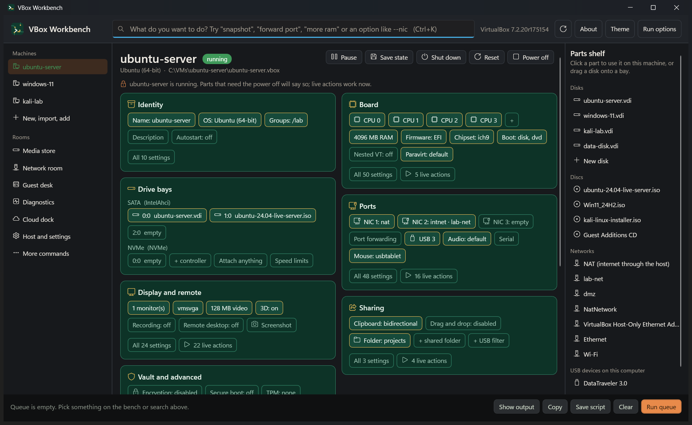
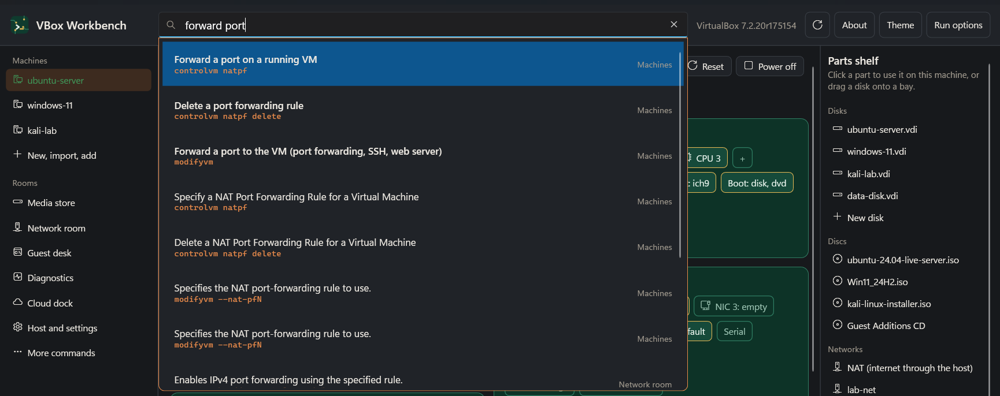
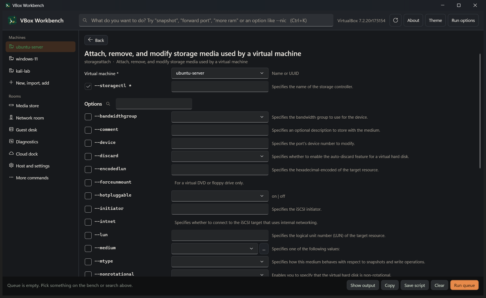
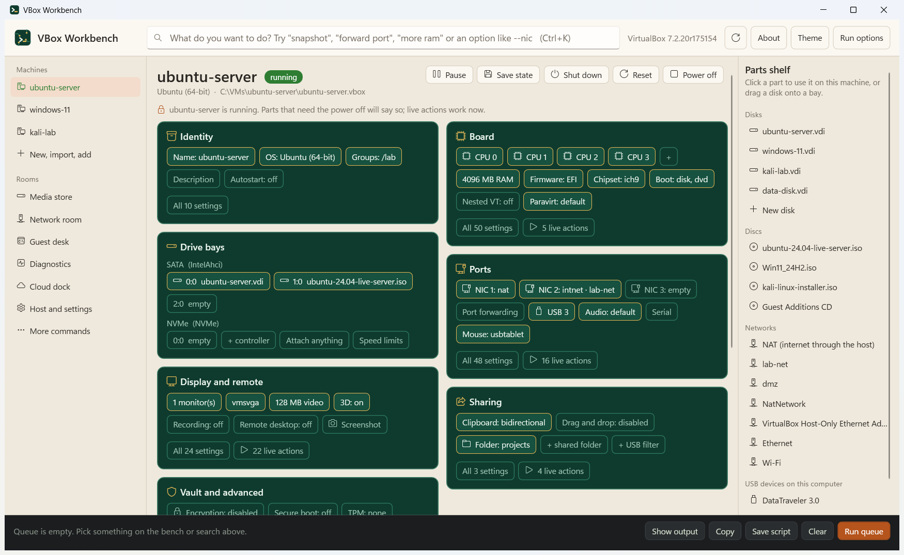
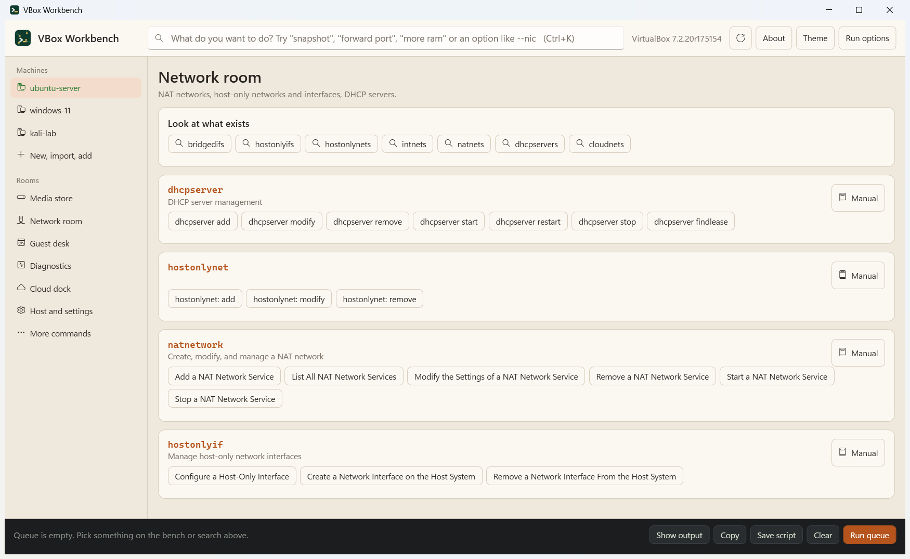

<p align="center">
  
</p>

# VBox Workbench

A graphical front end for `VBoxManage`, the VirtualBox command line. You open a virtual machine like a
PC on a workbench, click or drop parts onto it, and the app writes the `VBoxManage` commands for you.

**Website: https://mavi-cyber.github.io/VBoxWorkbench/** &nbsp;|&nbsp; **[Download the latest release](https://github.com/mavi-cyber/VBoxWorkbench/releases/latest)**



VBox Workbench is an independent project. It is not made, endorsed or supported by Oracle.

## Screenshots

| Search in plain words | A generated form |
| --- | --- |
|  |  |

| Light theme | Rooms |
| --- | --- |
|  |  |

The machines in these screenshots are made-up demo data.

## Features

- **Search bar** - type what you want ("forward port", "more ram", "snapshot") or an option name
  (`--nic`). Ctrl+K focuses it.
- **Workbench** - the selected machine as a circuit board. Each chip is a setting; dashed sockets are
  empty slots. Zones: identity, board, drive bays, ports, display, sharing, vault. Power buttons and a
  snapshot timeline sit around it.
- **Parts shelf** - your disks, ISOs, networks and USB devices. Click one to use it on the machine, or
  drag a disk onto a drive bay.
- **Rooms** - commands that are not about one machine: new and import, media store, network room,
  guest desk, diagnostics, cloud dock, host and settings.
- **Generated forms** - every action has a form with one field per option, its description, choices
  and file pickers, and the exact command line shown live.
- **Queue** - add several commands and run them in order, copy them, or save them as a `.cmd`, `.ps1`
  or `.sh` script. Destructive commands ask first.
- **Themes** - Light, Dark, or Follow Windows.
- **About box** - version, commit, project link, copyright and license, from the About button.

## Works with your VirtualBox version

The app does not ship a fixed list of commands. On first start it asks the installed `VBoxManage` what
it can do (`VBoxManage`, `VBoxManage commands`, `VBoxManage help <command>`), parses the usage lines and
option descriptions, and builds every form from that. The result is cached per VirtualBox version under
`%LOCALAPPDATA%\VBoxWorkbench`.

So when VirtualBox adds or renames a command or option, it shows up after the update without a new
release of this app. Anything the hand-written layout does not know yet lands in "More" (on the board)
or "More commands" (in the rooms) and is always reachable through search.

### VirtualBox 6.x and older

Before 7.0, `VBoxManage` prints its usage as one indented block per command and has no
`help <command>`. `LegacyUsage.cs` rewrites those blocks into ordinary usage lines, so the same forms
are generated. Those versions print no explanations, so the option descriptions, summaries and action
titles are borrowed from `fallback-help.json`, a copy of the 7.2 texts bundled with the app. The syntax
always comes from the installed version; a note in each form says when the explanation is borrowed.

Option names changed over time (`--nictype` became `--nic-type`, 7.2 added `--x86-` prefixes).
`OptionNames.Canonical` makes the board, the zones and the search phrases find an option under
whichever spelling the installed version uses.

This path is tested against the usage text printed in the 6.1 manual, not against a 6.1 installation.

### vboximg-mount

`vboximg-mount` (manual section 8.55) is a separate program that only exists on Linux and macOS hosts.
The app can build the command everywhere but can only run it there.

## Build and run

Needs the .NET 10 SDK and VirtualBox. The app itself is Windows only (WPF).

```
dotnet run --project src/VBoxWorkbench.App
dotnet test
```

The live tests create a throwaway VM in the temp folder, exercise the generated commands against the
real `VBoxManage`, then unregister and delete it. They do nothing when VirtualBox is not installed.

## Build a standalone .exe

The quick way is the script, which runs the tests, builds both variants into `dist\` and writes their
SHA-256 checksums:

```
powershell -ExecutionPolicy Bypass -File build-release.ps1
```

It produces:

| File | Size | Needs |
| --- | --- | --- |
| `VBoxWorkbench-<version>-win-x64.exe` | about 65 MB | nothing, .NET is included |
| `VBoxWorkbench-<version>-win-x64-needs-dotnet.exe` | under 1 MB | the [.NET 10 Desktop Runtime](https://dotnet.microsoft.com/download/dotnet/10.0) |
| `SHA256SUMS.txt` | | |

To do it by hand, the self-contained build is:

```
dotnet publish src/VBoxWorkbench.App -c Release -r win-x64 --self-contained true -p:PublishSingleFile=true -p:IncludeNativeLibrariesForSelfExtract=true -p:EnableCompressionInSingleFile=true -p:DebugType=none -o dist
```

and the small one that relies on an installed .NET runtime is:

```
dotnet publish src/VBoxWorkbench.App -c Release -r win-x64 --self-contained false -p:PublishSingleFile=true -p:DebugType=none -o dist
```

Either way the result is `dist\VBoxWorkbench.App.exe`, a single file you can copy anywhere. The version
number comes from `<Version>` in `src/VBoxWorkbench.App/VBoxWorkbench.App.csproj`.

### Checking a download

Compare the file's hash with the line for it in `SHA256SUMS.txt`:

```
Get-FileHash .\VBoxWorkbench-0.1.1-win-x64.exe -Algorithm SHA256
```

or, on Linux and macOS, `sha256sum -c SHA256SUMS.txt`.

The executables are not code-signed, so Windows SmartScreen may show an "unknown publisher" warning
the first time one is run.

## Deep links

For shortcuts and testing:

```
VBoxWorkbench.App.exe --show "snapshot take"
VBoxWorkbench.App.exe --room Network
VBoxWorkbench.App.exe --search "forward port"
VBoxWorkbench.App.exe --theme Dark
```

Set the `VBW_VBOXMANAGE` environment variable to the full path of a `VBoxManage` to make the app use
that one instead of the installed VirtualBox.

The theme choice is saved in `%LOCALAPPDATA%\VBoxWorkbench\settings.json`.

## Project layout

- `src/VBoxWorkbench.Core` - no UI. Usage-grammar parser (`Synopsis.cs`), help parser, legacy usage
  reader, catalog and cache, command builder, VM info reader, search index, and the curation layer
  (rooms, zones, danger list, plain-language phrases).
- `src/VBoxWorkbench.App` - WPF. `CommandForm` generates a form from one usage line; `Workbench.cs`
  draws the board; `Rooms.cs` lists every action of a room's commands; `Theme.cs` holds the palettes.
- `tests/VBoxWorkbench.Tests` - parser tests against saved help from 7.2.20, the 7.0 manual synopses
  and the 6.1 usage text, catalog coverage of manual sections 8.5 to 8.55, and the live tests.

- `docs` - the project website, served by GitHub Pages, and the screenshots used here.
- `assets` - the logo (`logo.svg`), the app icon (`app.ico`, 16 to 256 px) and `make-icon.py`, which
  regenerates `logo.png` and `app.ico` (needs Pillow).

To refresh the bundled descriptions from newer fixtures, run the tests with `VBW_WRITE_FALLBACK` set
to the path of `src/VBoxWorkbench.Core/fallback-help.json`.

## Credits

- **Oracle VirtualBox** - the virtualization software this app drives, and the source of all command
  syntax and help text. https://www.virtualbox.org
- **VirtualBox User Manual, chapter 8 "VBoxManage"** - the reference the app was designed against.
  https://www.virtualbox.org/manual/ch08.html
- **.NET and WPF** by Microsoft and contributors (MIT License) - runtime and UI framework.
- **xUnit**, **Microsoft.NET.Test.Sdk** and **coverlet** - used by the tests only, not shipped with
  the app.
- **Segoe Fluent Icons** - the icon font. It is part of Windows and is not bundled with the app.
- **Logo and app icon** - original artwork made for this project, under the same license as the code.
  It is deliberately unrelated to the VirtualBox logo, which is an Oracle trademark.

### Text taken from VirtualBox

These files are copied or derived from VirtualBox and remain the work of Oracle and/or its affiliates:

- `src/VBoxWorkbench.Core/fallback-help.json` - command summaries, action titles and option
  descriptions extracted from the help output of VBoxManage 7.2.20.
- `tests/VBoxWorkbench.Tests/Fixtures/v7.2.20/` - help output of VBoxManage 7.2.20.
- `tests/VBoxWorkbench.Tests/Fixtures/manual-7.0/` and `legacy-6.1/` - usage text from the VirtualBox
  7.0 and 6.1 user manuals.
- The `vboximg-mount` usage and option text in `src/VBoxWorkbench.Core/Catalog.cs`, from the user
  manual.

The VirtualBox base package, including `VBoxManage` and its help text, is released by Oracle under the
GNU General Public License version 3.

## License

Copyright (C) 2026 mavi-cyber

VBox Workbench is free software: you can redistribute it and/or modify it under the terms of the GNU
General Public License as published by the Free Software Foundation, version 3 of the License.

This program is distributed in the hope that it will be useful, but WITHOUT ANY WARRANTY; without even
the implied warranty of MERCHANTABILITY or FITNESS FOR A PARTICULAR PURPOSE. See the GNU General Public
License for more details.

The full license text is in the [LICENSE](LICENSE) file. It is also available at
https://www.gnu.org/licenses/gpl-3.0.html.

Why GPLv3: the app only starts `VBoxManage` as a separate program, which on its own would not decide
the license. It does, however, bundle help text copied from VirtualBox (see above), and that text is
under GPLv3, so the whole project is released under the same license.

## Trademarks

Oracle and VirtualBox are registered trademarks of Oracle and/or its affiliates. Windows is a
trademark of the Microsoft group of companies. Other names may be trademarks of their respective
owners. They are used here only to say what this app works with.
